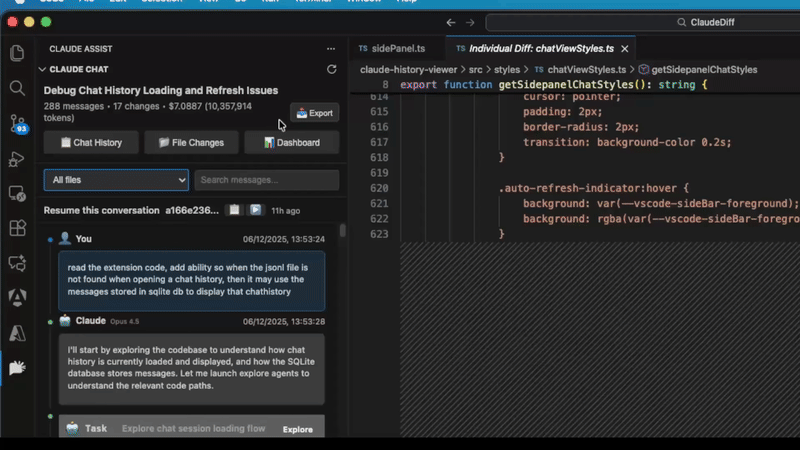
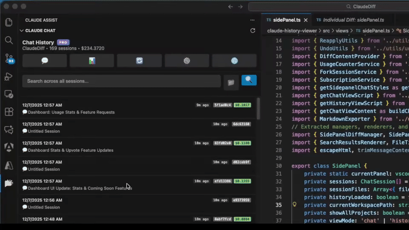

# Claude Code, Codex & OpenCode Assist - History & Diff Viewer for VS Code

> **Note**: This is an unofficial extension and is not made by or affiliated with Anthropic, OpenAI, or SST.

The complete **Claude Code history viewer**, **Codex session browser**, and **OpenCode chat explorer** for VS Code. Browse chat history, view file diffs, search across all conversations, track token usage and costs, and resume past sessions — all from the editor.

**🤖 Triple AI Assistant Support**:
- **Claude Code** sessions from `~/.claude/projects/`
- **Codex** sessions from `~/.codex/sessions/`
- **OpenCode** sessions from `~/.local/share/opencode/` (XDG-compliant)
- Visual badges clearly identify which assistant you were using
- Unified interface for seamless browsing across all three tools

## 🎬 Feature Demos

### 📊 Usage Analytics
Track Claude Code and Codex subscription usage and quotas, plus token trends across Claude Code, Codex, and OpenCode sessions in a single analytics dashboard.

### 📚 Chat History & Diff Viewer
Browse your Claude Code, Codex, and OpenCode sessions with GitHub-style diffs and one-click file changes.

### 🔍 Full-Text Search
Search across all conversations with instant results and session-grouped display.

### ⏱️ File History Timeline
View complete modification history for any file across all your sessions.

### 📄 Export to Markdown
Export conversations and plans to beautifully formatted Markdown files.

### ✅ Review Changes View
Review all file changes from a conversation in one organized place before applying updates.

### 🔀 Session Fork & Resume
Branch conversations and resume from any point in your chat history.

## 🌟 Features

### Smart Session Organization
- **Triple Assistant Support**: Full support for Claude Code, Codex, and OpenCode sessions with visual source badges
- **Welcome Guide**: First-time users get an interactive welcome screen showing all the features available - makes getting started super easy!
- **Sidepanel Interface**: Clean, intuitive sidebar panel for browsing chat sessions from Claude Code, Codex, and OpenCode
- **Project-Based Filtering**: Automatically organizes sessions by project with smart current-project detection
- **Session Pinning**: Pin important sessions to keep them at the top of your list for quick access
- **Custom Session Titles**: Rename sessions with custom titles to better organize your work
- **Latest Chat Priority**: Recent conversations are highlighted and easily accessible
- **Auto-Refresh**: Automatically updates recent sessions (configurable time window)
- **Session Resume**: Resume any past conversation directly in your terminal with one click, or copy the command to use elsewhere
- **Session Fork**: Create a new conversation starting from any message - perfect for exploring alternative approaches without losing your original chat. `Pro` 
- **Session Format Converter**: Convert sessions between Claude and Codex formats and resume instantly in the target assistant.`Pro`
- **Markdown Export**: Export full sessions to beautifully formatted Markdown files with customizable metadata options for sharing, documentation, or archival. `Pro`
- **Enhanced Message Display**: Beautiful formatting for command outputs, code snippets, and tool results with GitHub-style views. Full support for agent and task tool operations
- **Smart Session Titles**: Automatically extracts meaningful titles from your conversations with improved extraction from recent chat summaries
- **Advanced Tool Visualization**: Improved rendering of tool results including Bash outputs, file operations, and agent-based task execution
- **Session Management Commands**: Comprehensive commands for renaming sessions, managing custom titles, and toggling pin status

### Plan View & Management
- **Plan Browser**: Browse all your Claude Code plans from `~/.claude/plans/` directory in a dedicated interface
- **Plan Navigation**: Easily navigate between different plans with a clean, organized view
- **Plan Actions**: Copy plan content to clipboard, export to Markdown, or open in VS Code editor
- **Plan Export**: Export individual plans to beautifully formatted Markdown files. Export requires Pro.

### Advanced File Change Tracking
- **GitHub-Style Diffs**: Beautiful, readable diff views showing exactly what changed
- **Multi-Diff Support**: View changes across multiple files simultaneously
- **Review Changes View**: See all file changes from a conversation in one place with a clean, organized interface
- **Syntax Highlighting**: Code diffs with syntax highlighting for better readability
- **Undo & Reapply Changes**: Easily undo or reapply file modifications with one click
- **Native VS Code Integration**: Leverages VS Code's built-in diff viewer
- **Apply Changes**: One-click application of changes to your current workspace
- **File Operations**: Track Read, Write, Edit, and MultiEdit operations from Claude Code, Codex, and OpenCode
- **Universal Support**: Works seamlessly with Claude Code, Codex, and OpenCode sessions, with visual badges to tell them apart

### Powerful Search & Navigation
- **Multiple Search Modes**: Choose between indexed search for speed or direct file search for privacy - whatever works best for you
- **Detailed Search Results**: See cost, tokens, and message count for each session right in the search results
- **Session-Grouped Results**: Search results are organized by session with collapsible groups, showing all matches within each conversation for easier navigation
- **Fast and Accurate**: Find what you need quickly with optimized search that understands your queries
- **Privacy-Friendly Options**: New privacy mode lets you search without storing your messages separately - they stay only in your local files
- **Search Highlighting**: Visual highlighting of search terms in results so you can quickly spot what you're looking for
- **Session File Paths**: Search results display file paths for easier identification and navigation
- **Session Navigation**: Jump directly to specific conversations with one click
- **File History Timeline**: See complete modification history for any file across all your sessions. Visual timeline shows when files were changed, what operations were performed, and provides quick access to view diffs or navigate to the conversation
- **Right-Click Context Menu**: Right-click any file in the explorer or editor to select "Show in Claude History Timeline" and instantly view its modification history
- **Quick Access**: Command palette integration for rapid access to all search features

### Status Bar Navigation
- **Real-Time File Monitoring**: Status bar integration showing current file change status
- **Quick Navigation**: Navigate between file changes using keyboard shortcuts
- **Loading State Indicators**: Visual feedback during file operations
- **Seamless Workflow**: Integrated navigation without leaving your editor
- **API Usage Quota Indicator**: Optional status bar display of remaining Claude/Codex quota with quick access to the dashboard

### 📊 Advanced Analytics & Cost Tracking
- **Comprehensive Cost Analysis**: Detailed cost tracking with token usage breakdown across all Claude, OpenAI, and OpenCode-supported models
- **Dashboard Analytics**: Interactive dashboard with usage statistics, activity timelines, and cost trends
- **Plan Usage & Quota Tracking**: Live Claude/Codex quota cards, burn-down chart, and weekly summary insights
- **Engagement Distribution**: Visual breakdown of your usage patterns across different features and activities
- **Usage Engagement Metrics**: Understand your development patterns with comprehensive analytics tracking
- **Session Block Tracking**: Billing window identification following ccusage logic for accurate cost periods
- **Token Usage Insights**: Detailed tracking of input, output, cache creation, and cache read tokens
- **Daily Usage Statistics**: Track your daily usage patterns with activity heatmaps and efficiency metrics
- **Cumulative Statistics**: Persistent tracking of your extension usage over time
- **Model-Specific Breakdown**: Cost analysis per model with cache token optimization insights

### 🏆 Community Features (Optional)
- **Leaderboard Integration**: Optional community leaderboard with anonymous usage comparison
- **User Profile Management**: Create profiles with privacy controls and data sharing preferences
- **Achievement System**: Track coding milestones and compare with community stats
- **Anonymous Analytics**: Opt-in community features while maintaining complete privacy control

## 🚀 Getting Started

### Prerequisites
- VS Code 1.80.0 or later
- **Claude Code CLI**, **Codex**, and/or **OpenCode CLI** installed and configured
- Existing chat history:
  - Claude Code sessions in `~/.claude/projects/`
  - Codex sessions in `~/.codex/sessions/` (if using Codex)
  - OpenCode sessions in `~/.local/share/opencode/` (if using OpenCode)

### Installation
1. Install from the VS Code Extensions marketplace
2. The extension automatically detects your Claude, Codex, and OpenCode directories
3. Click the Claude Assist icon in the Activity Bar to start browsing

### Quick Start
1. **Open the Extension**: Click the Claude Assist icon in VS Code's Activity Bar
2. **Browse Sessions**: Use the "Latest Chat" tab for recent conversations or "Chat History" for all sessions from Claude Code, Codex, and OpenCode
3. **View Changes**: Click any session to see the conversation and file changes (source badge shows Claude, Codex, or OpenCode)
4. **Review Diffs**: Use "File Changes" to see a commit-style summary with syntax-highlighted diffs
5. **Search History**: Use the powerful SQLite-based search within the extension's side panel to find conversations across all three assistants
6. **Navigate Files**: Use status bar buttons or keyboard shortcuts (`Ctrl+Shift+]` / `Ctrl+Shift+[`) to navigate between file changes
7. **Analyze Costs**: Access the Dashboard tab to view detailed cost analysis and usage statistics for Claude Code, Codex, and OpenCode
8. **Check Plan Usage**: Review your Claude/Codex quota and usage trends in the dashboard
9. **Join Community** (Optional): Enable leaderboard features to compare usage with the community
10. **Quick Access**: Press `Ctrl+Shift+Q` to quickly open the chat side panel

## 📋 Main Commands

### Available in Command Palette (Ctrl+Shift+P)

| Command | Description |
|---------|-------------|
| `Claude Assist: Refresh Sessions` | Reload session data and rebuild search index |
| `Claude Assist: Clear Project Cache` | Clear internal caches (troubleshooting) |
| `Claude Assist: Open Settings` | Access extension settings and configuration |
| `Claude Assist: Refresh API Usage Quota` | Refresh Claude/Codex quota data for the dashboard and status bar |
| `Claude Assist: Open Claude Chat Side Panel` | Open the Claude chat side panel |

### Keyboard Shortcuts

| Shortcut | Command | Description |
|----------|---------|-------------|
| `Ctrl+Shift+]` / `Cmd+Shift+]` | Navigate Next | Navigate to next file change in history |
| `Ctrl+Shift+[` / `Cmd+Shift+[` | Navigate Previous | Navigate to previous file change in history |
| `Ctrl+Shift+Q` / `Cmd+Shift+Q` | Open Side Panel | Open Claude chat side panel |

### Context Menu Commands
Additional commands are available through right-click context menus and the extension's interface:
- Show File Diff
- Apply Changes to Workspace  
- Open File in Editor
- View File Changes

## ⚙️ Configuration

### Settings
- **`claude-history.claudeDirectory`**: Custom path to .claude directory (auto-detected if empty)
- **`claude-history.autoRefreshEnabled`**: Enable automatic refresh for recent sessions from Claude Code, Codex, and OpenCode (default: true)
- **`claude-history.autoRefreshInterval`**: Time window in hours for auto-refresh (default: 2 hours)
- **`claude-history.enableErrorReporting`**: Enable anonymous error reporting for debugging (default: true)
- **`claude-history.statusBar.showApiUsage`**: Display the API usage quota indicator (default: true)
- **`claude-history.contextMenu.showFileTimeline`**: Show "Show in Claude History Timeline" in file context menus (default: true)
- **`claude-history.search.maxFileSize`**: Maximum file size in MB for search indexing (default: 50)
- **`claude-history.search.maxMessagesPerFile`**: Maximum messages per file to process (default: 1000)
- **`claude-history.leaderboard.enableSharing`**: Enable community leaderboard data sharing (default: false)
- **`claude-history.dashboard.showCostBreakdown`**: Show detailed cost breakdown in dashboard (default: true)

### Customization
Access settings via:
- File → Preferences → Settings → Extensions → Claude Code Assist
- Or search for "Claude History" in VS Code settings

## 🔧 Troubleshooting

### 🍎 **macOS Compatibility**
✅ **Fully Supported** - The extension works perfectly on all Macs including Apple Silicon (M1/M2/M3/M4) and Intel processors.

**Note**: If you're using a version older than v0.2.1, please update to the latest version for full macOS compatibility. Earlier versions had native module issues that have been resolved with WebAssembly.

### Common Issues

**"No Claude, Codex, or OpenCode directory found"**
- Ensure Claude Code CLI, Codex, and/or OpenCode CLI is installed and has been used at least once
- Check that `~/.claude/projects/`, `~/.codex/sessions/`, and/or `~/.local/share/opencode/` directories exist
- Manually set the Claude, Codex, or OpenCode directory in extension settings if using a custom location

**Sessions not loading**
- Click "Refresh Sessions" in the panel
- Check if your Claude, Codex, and OpenCode directory paths are correct in settings
- Verify that session files exist:
  - Claude: JSONL files in `~/.claude/projects/`
  - Codex: Session files in `~/.codex/sessions/`
  - OpenCode: SQLite database in `~/.local/share/opencode/`

**Diffs not showing correctly**
- Ensure the files exist in your current workspace
- The extension tries to match files by relative path from project root
- For missing files, you'll be prompted to create them

**Performance issues with large history**
- The extension loads sessions incrementally with intelligent caching
- Search index is automatically compressed and optimized for large datasets  
- Use "Load More Sessions" to expand history as needed
- Clear project cache if experiencing slowdowns
- Rebuild search index if search performance degrades

**Search not returning expected results**
- Ensure SQLite search index has been built (automatic on first use)
- Try rebuilding the search index via "Refresh Sessions"  
- Check search query syntax - supports full-text search with SQLite FTS
- Verify database integrity if search results are inconsistent
- Clear search cache if results seem outdated

**Database-related issues**
- The extension uses SQLite (WebAssembly) for improved performance and cross-platform compatibility
- Database files are stored in the extension's global storage directory
- Use "Rebuild Search Index" if experiencing database corruption
- Check file permissions if database operations fail
- v0.2.1+ uses sql.js (WASM) instead of native sqlite3 for universal compatibility

**Cross-Platform Compatibility**
- ✅ **Windows**: Fully supported (all versions)
- ✅ **macOS**: Fixed in v0.2.1 - works on Intel and Apple Silicon Macs
- ✅ **Linux**: Fully supported (all architectures)
- Single .vsix file works on all platforms - no more architecture-specific issues!

### Data Privacy
- **100% Local**: All core data processing happens locally on your machine
- **Optional Cloud Features**: Leaderboard functionality is completely optional and requires explicit opt-in
- **Privacy Controls**: Full control over what data (if any) is shared with community features
- **Read-Only by Default**: Only reads your existing Claude Code, Codex, and OpenCode session files
- **Workspace Integration**: Only accesses your current VS Code workspace for file operations
- **Anonymous Participation**: Community features use anonymous device IDs, never personal information

## 🏗️ Architecture Overview

The extension is built with a modular architecture:

- **Data Layer**: Parsers for Claude Code (JSONL), Codex (JSONL), and OpenCode (SQLite) sessions with a unified SQLite database for efficient chat history processing
- **Database Services**: SQLite-based search, cost tracking, and analytics with comprehensive data models supporting all three assistants
- **UI Layer**: Modern webview panels with GitHub-style interfaces, syntax highlighting, and interactive dashboards
- **Services**: File watching, incremental parsing, project mapping for Claude Code, Codex, and OpenCode
- **Utilities**: Advanced diff rendering with syntax highlighting, cost calculation, search indexing, and file operations
- **Analytics**: Comprehensive usage tracking, cost analysis across all three assistants, and community features (optional)

## 📝 Version History

See [CHANGELOG.md](./CHANGELOG.md) for detailed release notes.

## 🤝 Contributing

We welcome contributions! See [CONTRIBUTING.md](./CONTRIBUTING.md) for development setup and guidelines.

## 📄 License

Proprietary - See [LICENSE](./LICENSE) for terms

This software is proprietary and confidential. The extension is free to use but the source code is not open source.

## Contact & Support

Have questions, suggestions, or want to connect? Reach out to me!

**📧 Email:** yashagl10@gmail.com
**🐦 Twitter/X:** [@yashagl](https://x.com/yashagl)

I'm always happy to help with issues, discuss new features, or chat about development!

## 🔗 Links

- [GitHub Repository](https://github.com/yashagldit/Claude-Code-History-VSCode)
- [VS Code Marketplace](https://marketplace.visualstudio.com/items?itemName=agsoft.claude-history-viewer)
- [Claude Code CLI](https://docs.anthropic.com/en/docs/claude-code)
- [Codex](https://github.com/openai/codex)
- [OpenCode CLI](https://opencode.ai/)
- [Twitter/X: @yashagl](https://x.com/yashagl)

---

**Enhance your development workflow with comprehensive history visualization, file change tracking, and intelligent session management across Claude Code, Codex, and OpenCode.**
