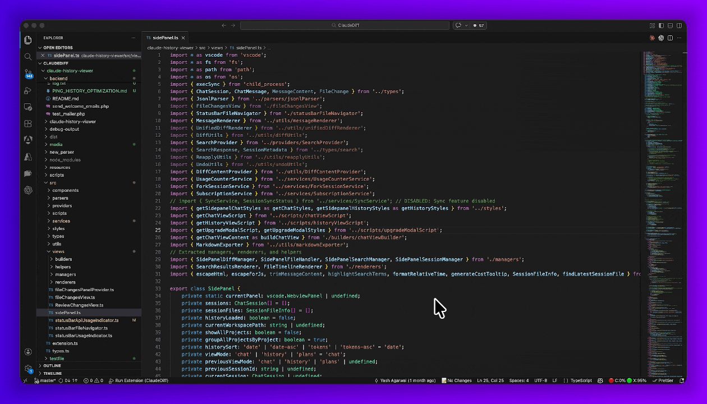
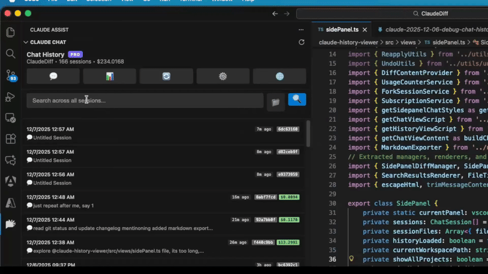
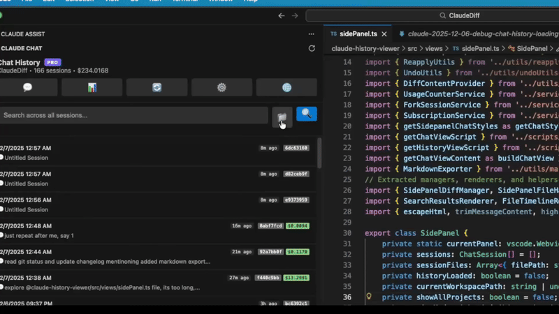
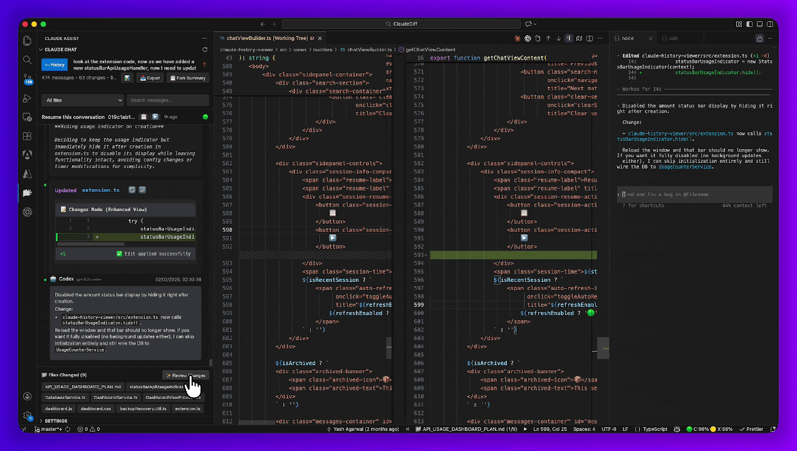

# Claude Code, Codex & OpenCode Assist - History & Diff Viewer for VS Code

> **Note**: This is an unofficial extension and is not made by or affiliated with Anthropic, OpenAI, or SST.

Browse your **Claude Code**, **Codex**, and **OpenCode** chat history right inside VS Code — view file diffs, search across every conversation, track token usage and cost, and resume past sessions without leaving the editor.

**🤖 Works with all three assistants:**
- **Claude Code** — `~/.claude/projects/`
- **Codex** — `~/.codex/sessions/`
- **OpenCode** — `~/.local/share/opencode/`

Sessions from all three appear in one unified list with badges that tell them apart.

## 🎬 Feature Demos

### 📊 Usage Analytics
Track subscription quota and token trends across Claude Code, Codex, and OpenCode in a single dashboard.

### 📚 Chat History & Diff Viewer
Browse sessions with GitHub-style diffs and one-click file changes.

### 🔍 Full-Text Search
Search across all conversations with instant, session-grouped results.

### ⏱️ File History Timeline
See the complete modification history for any file across all your sessions.

### ✅ Review Changes
See every file change from a conversation in one place.

## 🌟 Features

### Sessions & History
- **Unified history** for Claude Code, Codex, and OpenCode, organized by project with current-project detection
- **Quick actions & keyboard navigation** — pin, resume, or delete from a session row; move with arrow keys, open with Enter, remove with Delete
- **Live search filter** to narrow the list as you type
- **Pin & rename** important sessions to keep them at the top
- **Resume** any conversation in the terminal, desktop app, or VS Code — or copy the command to run elsewhere
- **Fork** a conversation from any message to explore an alternative without touching the original `Pro`
- **Format converter** between Claude and Codex, resuming straight into the target assistant `Pro`
- **Auto-refresh** keeps recent sessions up to date while they're still changing

### Archiving & Markdown Sync
- **Session Archive** — Claude and Codex eventually clean up old transcripts; archiving keeps a full-fidelity copy safe in its own folder, browsable from a dedicated **Archived** tab. Viewing and restoring archived sessions is always free. `Pro` to archive
- **Markdown export** of full sessions with customizable metadata `Pro`
- **Markdown sync** — exported sessions can be committed to git, moved between devices, imported back with file changes intact, or resumed as a native session (even across operating systems)
- **Bulk actions** — select multiple sessions to export or delete them together `Pro`

### File Changes & Diffs
- **GitHub-style diffs** with syntax highlighting and multi-file support
- **Review Changes view** — see every file change from a conversation in one place
- **Apply, undo, or reapply** changes to your workspace with one click
- **File history timeline** — view a file's full change history across sessions; right-click any file to open it

### Search
- **Indexed or direct search** — choose speed (SQLite full-text) or privacy (search files directly, nothing stored separately)
- **Session-grouped results** with cost, token, and message counts, plus highlighted matches

### Analytics & Cost Tracking
- **Dashboard** with usage statistics, activity timelines, and cost trends
- **Quota tracking** — live Claude/Codex quota cards, burn-down chart, and weekly summary, with per-model (Sonnet / Opus) breakdown
- **Detailed cost analysis** across all supported Claude, OpenAI, and OpenCode models, including cache-token insights
- **Status bar quota indicator** with quick access to the dashboard

## 💎 Pricing

Free for everyday use. A few advanced features require Pro.

|   | Free | Pro |
|---|---|---|
| Browse recent sessions | ✓ (last 7 days) | ✓ (unlimited) |
| Search, diffs, dashboard | ✓ (recent) | ✓ (unlimited history) |
| Markdown export & bulk actions | — | ✓ |
| Session archiving | — | ✓ |
| Session forking & format conversion | — | ✓ |
| Devices | 2 | 5 |

See [ccassist.dev](https://ccassist.dev) for current pricing and refund policy.

## 🔒 Privacy

Chat content stays on your machine — the extension reads `~/.claude/projects/` and `~/.codex/sessions/` locally and stores everything in a local SQLite database. You can verify with any network proxy: no chat text, file content, or diffs are ever sent.

What is sent by default: an anonymized device ID, OS/extension version, and aggregated usage counters (e.g. "session opened", "search ran"). Error reports include error messages and stack traces, never chat content. Both can be turned off in extension settings (`enableErrorReporting`, `enableUsageStatsSharing`).

## 🚀 Getting Started

**Prerequisites:** VS Code 1.80.0+ and an existing history from Claude Code, Codex, and/or OpenCode.

1. Install from the VS Code Extensions marketplace
2. The extension auto-detects your Claude, Codex, and OpenCode directories
3. Click the Claude Assist icon in the Activity Bar to start browsing, or press `Ctrl+Shift+Q` to open the side panel

Click any session to see the conversation and its file changes, use **File Changes** for a commit-style diff summary, and open the **Dashboard** tab for cost and quota analytics.

## ⌨️ Commands & Shortcuts

Open the Command Palette (`Ctrl+Shift+P`) and search for **Claude Assist** — refresh sessions, open the dashboard, refresh API usage quota, open the side panel, and more.

| Shortcut | Action |
|----------|--------|
| `Ctrl/Cmd+Shift+]` | Next file change |
| `Ctrl/Cmd+Shift+[` | Previous file change |
| `Ctrl/Cmd+Shift+Q` | Open side panel |
| `Ctrl+Alt+;` | Recent file changes (quick pick) |

Additional actions (show diff, apply changes, open file, view file changes, show in timeline) are available via right-click context menus.

## ⚙️ Configuration

Access via **Settings → Extensions → Claude Code Assist**, or search "Claude History" in VS Code settings. Useful options include:

- **`claude-history.claudeDirectory`** — custom `.claude` path (auto-detected if empty)
- **`claude-history.archiveDirectory`** / **`claude-history.export.directory`** — where archived and exported sessions are stored
- **`claude-history.autoRefreshEnabled`** / **`autoRefreshInterval`** — auto-refresh for recent sessions
- **`claude-history.dateFormat`** — ISO or your system's regional format
- **`claude-history.resume.defaultTargetClaude`** / **`defaultTargetCodex`** — where sessions resume by default
- **`claude-history.statusBar.showApiUsage`** — show the quota indicator
- **`claude-history.enableErrorReporting`** / **`enableUsageStatsSharing`** — toggle anonymous reporting

## 🔧 Troubleshooting

**"No Claude, Codex, or OpenCode directory found"** — make sure the relevant CLI has been used at least once and the directory exists, or set a custom path in settings.

**Sessions not loading** — click **Refresh Sessions** and verify your directory paths.

**Diffs not showing correctly** — the extension matches files by relative path from the project root; make sure the file exists in your current workspace.

**Performance with large history** — sessions load incrementally with caching; use **Clear Project Cache** or rebuild the search index if things slow down.

The extension uses SQLite via WebAssembly, so it works identically on Windows, macOS (Intel & Apple Silicon), and Linux from a single build.

## 📝 Version History

See [CHANGELOG.md](./CHANGELOG.md) for detailed release notes.

## 📄 License

Proprietary — see [LICENSE](./LICENSE) for terms. The extension is free to use but the source code is not open source.

## Contact & Support

Questions, suggestions, or just want to connect? Reach out!

**📧 Email:** yash@ccassist.dev
**🐦 Twitter/X:** [@yashagl](https://x.com/yashagl)

## 🔗 Links

- [VS Code Marketplace](https://marketplace.visualstudio.com/items?itemName=agsoft.claude-history-viewer)
- [GitHub Repository](https://github.com/yashagldit/Claude-Code-History-VSCode)
- [Claude Code CLI](https://docs.anthropic.com/en/docs/claude-code) · [Codex](https://github.com/openai/codex) · [OpenCode CLI](https://opencode.ai/)

---

**Enhance your workflow with comprehensive history, file-change tracking, and session management across Claude Code, Codex, and OpenCode.**
